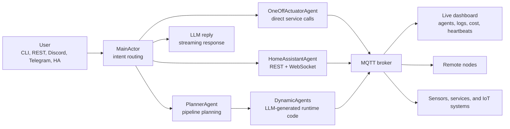

<p align="center">
  
</p>
<p align="center">
  <picture>
    <source media="(prefers-color-scheme: dark)"  srcset="https://raw.githubusercontent.com/waldiez/wactorz/main/.github/assets/title-dark.svg">
    <source media="(prefers-color-scheme: light)" srcset="https://raw.githubusercontent.com/waldiez/wactorz/main/.github/assets/title-light.svg">
    
  </picture>
</p>

<p align="center"><strong>AI agents that don't stop when you close the tab.</strong></p>

<p align="center">
<a href="https://docs.waldiez.io/wactorz/">Docs</a> |
<a href="https://docs.waldiez.io/wactorz/guide/development.html">Installation</a> |
<a href="https://docs.waldiez.io/wactorz/guide/architecture.html">Architecture</a> |
<a href="https://github.com/waldiez/wactorz/blob/main/ha-addon/DOCS.md">Home Assistant Addon</a> |
<a href="https://github.com/waldiez/wactorz/issues">Issues</a>
</p>

<p align="center">
<a href="https://github.com/waldiez/wactorz/actions/workflows/ci.yml"></a>
<a href="https://pypi.org/project/wactorz/"></a>
<a href="https://github.com/waldiez/wactorz/blob/main/LICENSE"></a>
<a href="https://python.org"></a>
<a href="https://mosquitto.org"></a>
<a href="https://github.com/waldiez/wactorz/blob/main/ha-addon/DOCS.md"></a>

</p>

---

<!--
  TODO(promo): drop a hero demo GIF here — the highest-impact addition to this README.
  Record a ~15s screencast of the dashboard running one end-to-end automation
  (e.g. the "person detected on camera → office light on" example below), export
  to GIF, commit under .github/assets/demo.gif, and uncomment:

  <p align="center"></p>
-->

Wactorz runs LLM-driven agents as long-lived actors on the hardware you already have - a Raspberry Pi in the garage, an old laptop, a VM in your closet. You describe what you want in chat; the planner writes the Python, spawns it on a node, and supervises it. When an agent crashes, only that one restarts. State persists across restarts and you can move an agent to a different machine without losing it.

It runs on MQTT, so anything happening inside the system surfaces as a topic external code can subscribe to. Home Assistant talks to it the same way Discord and Telegram do - it's one channel among several, alongside a REST API and an MCP server. The LLM provider is configurable (Anthropic, OpenAI, Gemini, NIM) or fully local via Ollama for offline use.

---

## How Wactorz is different

Most agent frameworks build a **crew that runs a task and exits**. Wactorz builds a
**system that keeps running**. Agents are long-lived, supervised actors — they persist
their state, restart themselves when they crash, and can move between machines — rather
than functions you call inside one script.

| | Wactorz | Orchestration libraries (LangChain, CrewAI, AutoGen) | Visual automation (n8n, Node-RED) | HA native automations |
|---|---|---|---|---|
| **Lifecycle** | Long-lived, self-supervising actors | Task-scoped, exit when the script ends | Long-lived flows | Long-lived rules |
| **Failure handling** | Per-agent crash isolation + restart | Your code handles it | Per-flow | Per-rule |
| **Distribution** | Agents spawn and migrate across nodes over MQTT | Single process | Single instance | Single instance |
| **How agents are built** | LLM writes and runs the Python at runtime | You write the chain | You wire nodes by hand | You write YAML |
| **Runs offline / self-hosted** | Yes — BYO key or fully local via Ollama | Varies | Yes | Yes |

It's **not** a replacement for Home Assistant — it sits alongside it, adding an LLM
planner and dynamic agents on top of the home you already automate.

---

## Quick Start

```bash
git clone https://github.com/waldiez/wactorz
cd wactorz
pip install -e ".[all]"

# Start the MQTT broker
docker compose up -d mosquitto

# Set your provider, model, and key (or put them in .env)
export LLM_PROVIDER=anthropic   # anthropic | openai | ollama | nim | gemini
export LLM_MODEL=claude-sonnet-4-6
export LLM_API_KEY=your-key-here

python -m wactorz
```

Dashboard: `http://localhost:8888`.

> [!WARNING]
> **Run Wactorz only on a trusted local network.** The dashboard, REST API, and MQTT
> broker are unauthenticated by default, and agents can execute code. Do not expose
> ports `8888`, `8000`, or `1883` to the internet or an untrusted LAN. See
> [Security](#security) before deploying anywhere shared.

If you'd rather skip the clone, [pull the image from Docker Hub](https://docs.waldiez.io/wactorz/guide/dockerhub.html). To run without an API key, use Ollama:

```bash
ollama pull llama3
python -m wactorz --llm ollama --ollama-model llama3
```

Windows setup is in [docs/windows.md](https://github.com/waldiez/wactorz/blob/main/docs/windows.md); the full set of deployment options lives in [docs/deployment.md](https://docs.waldiez.io/wactorz/guide/deployment.html).

---

## Example prompts

```text
when a person is detected in my pc camera, open the office light
when the door opens, make reachy wakeup
when the light has been on for too long, send me a discord notification
```

---

## Architecture



---

## Interfaces

| Interface | How to use it |
|---|---|
| CLI | `python -m wactorz` |
| Live dashboard | `http://localhost:8888` |
| REST API | `python -m wactorz --interface rest` |
| Discord | `python -m wactorz --interface discord` |
| Telegram | `python -m wactorz --interface telegram` |
| MCP server | `wactorz-mcp` |
| Home Assistant addon | One-click install inside the HA Supervisor |

---

## LLM Configuration

Set these three env vars in `.env` or export them in your shell:

```bash
# Options: anthropic | openai | ollama | nim | gemini | none
LLM_PROVIDER=anthropic

# Model ID — examples:
#   anthropic  →  claude-sonnet-4-6
#   openai     →  gpt-4o
#   ollama     →  llama3
#   nim        →  meta/llama-3.3-70b-instruct
#   gemini     →  gemini-2.5-flash
LLM_MODEL=claude-sonnet-4-6

# Generic key — used for anthropic / openai / nim / gemini
# For Ollama, set OLLAMA_URL instead (default: http://localhost:11434)
# For OpenAI-compatible endpoints (Groq, Together, vLLM…), set OPENAI_URL to redirect
LLM_API_KEY=your-key-here

# Optional — sampling temperature for every LLM call.
# 0 = deterministic (recommended for device control and classification);
# leave unset/empty to keep each provider's own default.
# Ignored on Claude models from Opus 4.7 onward, which no longer accept it.
LLM_TEMPERATURE=0
```

At startup Wactorz logs the configuration it resolved, so you can confirm it at a glance:

```text
LLM: anthropic/claude-sonnet-4-6 | temperature=0.0
```

### Per-call-site overrides (hybrid setups)

Optionally, route individual call sites to different models with `LLM_OVERRIDES` —
for example run the cheap, high-frequency calls on a local model and keep the
planner on a hosted one:

```bash
# <site>=<provider>[:<model>], comma-separated. Unlisted sites use the global provider.
LLM_OVERRIDES="intent=ollama:qwen3:4b,actuator=ollama:llama3,planner=anthropic:claude-sonnet-4-6"
```

Sites: `main` (conversation), `intent` (intent routing), `planner` (pipeline
planning/codegen), `actuator` (one-off device control), `ha` (Home Assistant
agent), `dynamic` (the `get_llm()` shim inside generated agents).

To compare models per call site before choosing an override, run the built-in
evaluation harness — it scores each site automatically and reports accuracy,
latency and cost:

```bash
python -m wactorz.evalharness \
  --models "ollama:qwen3:4b,anthropic:claude-sonnet-4-6" --temperature 0
```

See [docs/evaluation.md](docs/evaluation.md) for the benchmark format and metrics.

---

## Security

> Wactorz is under active development. Treat the current release as **alpha** from a
> security standpoint and deploy accordingly.

**Threat model — what to assume today:**

- The **monitor dashboard, REST API, WebSocket, and MQTT broker are unauthenticated**
  by default. Anyone who can reach those ports can spawn, control, and delete agents.
- **Agents can execute code** (the planner generates and runs Python; remote nodes run
  spawned code over SSH/MQTT). Anyone who can reach the control plane can run code on
  the host and on any connected node.
- The bundled MQTT broker ships with **anonymous access** for local development.

**Deployment rules:**

- ✅ Run on a **trusted local network** you control (a home LAN, a private VLAN).
- ✅ Prefer the **Home Assistant add-on**, which keeps the UI behind HA's ingress auth.
- ❌ **Do not** expose ports `8888` (dashboard), `8000` (REST/WS), or `1883` (MQTT)
  to the internet or a shared/untrusted network.
- ❌ **Do not** run it as a multi-user or multi-tenant service yet.
- If you must reach it remotely, put it behind a VPN or an authenticating reverse
  proxy — never a bare port-forward.

Found a security issue? Please see [SECURITY.md](https://github.com/waldiez/wactorz/blob/main/SECURITY.md)
rather than opening a public issue.

---

## Repository Map

| Path | What lives there |
|---|---|
| `wactorz/` | Python actor runtime, built-in agents, interfaces, monitoring, HA integration |
| `frontend/` | Vite + TypeScript card dashboard |
| `ha-addon/` | Home Assistant Supervisor addon |
| `docs/` | Markdown docs source |
| `infra/` | Mosquitto, Prometheus, OpenTelemetry, nginx, and HA configs |
| `tests/` | Python test suite |

---

## Documentation

| Start here | For |
|---|---|
| [Quickstart](https://github.com/waldiez/wactorz/blob/main/docs/quickstart.md) | First run and Windows setup |
| [Docker Hub](https://docs.waldiez.io/wactorz/guide/dockerhub.html) | Run from Docker without cloning the repo |
| [Architecture](https://docs.waldiez.io/wactorz/guide/architecture.html) | Actor system, supervision, MQTT flow |
| [Agents](https://docs.waldiez.io/wactorz/guide/agents.html) | Built-in agents, recipes, and dynamic agents |
| [Pipelines](https://docs.waldiez.io/wactorz/guide/pipelines.html) | Reactive automation patterns |
| [Remote nodes](https://docs.waldiez.io/wactorz/guide/remote-nodes.html) | Edge deployment over SSH |
| [Interfaces](https://docs.waldiez.io/wactorz/guide/interfaces.html) | CLI, REST, chat platforms, dashboard, MCP |
| [API reference](https://github.com/waldiez/wactorz/blob/main/docs/api.md) | REST endpoints and payloads |
| [Deployment](https://docs.waldiez.io/wactorz/guide/deployment.html) | Docker, Home Assistant add-on, environment setup |
| [Prometheus](https://docs.waldiez.io/wactorz/guide/prometheus.html) | Metrics and monitoring |
| [Evaluation harness](https://github.com/waldiez/wactorz/blob/main/docs/evaluation.md) | Compare models per LLM call site |
| [Technical reference](https://github.com/waldiez/wactorz/blob/main/docs/reference.md) | Deeper internals |

---

## Contributors

<!-- ALL-CONTRIBUTORS-LIST:START - Do not remove or modify this section -->
<!-- prettier-ignore-start -->
<!-- markdownlint-disable -->
<table>
  <tbody>
    <tr>
      <td align="center" valign="top" width="14.28%">
        <a href="https://github.com/ounospanas">
          
          <br /><sub><b>Panagiotis Kasnesis</b></sub>
        </a>
        <br />
        <a href="#projectManagement-ounospanas" title="Project Management">📆</a>
        <a href="https://github.com/waldiez/wactorz/commits?author=ounospanas" title="Code">💻</a>
      </td>
      <td align="center" valign="top" width="14.28%">
        <a href="https://github.com/lazToum">
          
          <br /><sub><b>Lazaros Toumanidis</b></sub>
        </a>
        <br />
        <a href="https://github.com/waldiez/wactorz/commits?author=lazToum" title="Code">💻</a>
        <a href="#design-lazToum" title="UI & Design">🎨</a>
      </td>
      <td align="center" valign="top" width="14.28%">
        <a href="https://github.com/hchris0">
          
          <br /><sub><b>Chris</b></sub>
        </a>
        <br />
        <a href="https://github.com/waldiez/wactorz/commits?author=hchris0" title="Code">💻</a>
        <a href="#userTesting-hchris0" title="User Testing">📓</a>
      </td>
      <td align="center" valign="top" width="14.28%">
        <a href="https://github.com/amaliacontiero">
          
          <br /><sub><b>Amalia Contiero</b></sub>
        </a>
        <br />
        <a href="https://github.com/waldiez/wactorz/commits?author=amaliacontiero" title="Code">💻</a>
        <a href="#promotion-amaliacontiero" title="Promotion">📣</a>
      </td>
    </tr>
  </tbody>
</table>
<!-- markdownlint-restore -->
<!-- prettier-ignore-end -->
<!-- ALL-CONTRIBUTORS-LIST:END -->

Contributions of any kind are welcome. See [CONTRIBUTING.md](https://github.com/waldiez/wactorz/blob/main/CONTRIBUTING.md) to get started.

---

## Contributing

| What | How |
|---|---|
| Found a bug | [Open an issue](https://github.com/waldiez/wactorz/issues/new?template=bug_report.yml) |
| Have an idea | [Start a discussion](https://github.com/waldiez/wactorz/discussions) |
| Want to code | Fork, branch, and open a PR against `dev` (`main` is releases only) |
| Docs, tests, UI | Same drill, open a PR |
| New agent recipe | Add it in `wactorz/catalogue_agents/` and open a PR |
| Home Assistant | HA integrations and addon config PRs are very welcome |

Read [CONTRIBUTING.md](https://github.com/waldiez/wactorz/blob/main/CONTRIBUTING.md) for setup instructions, code style, and the PR process.

---

## License

[Apache 2.0](https://github.com/waldiez/wactorz/blob/main/LICENSE). Free to use, modify, and distribute.
