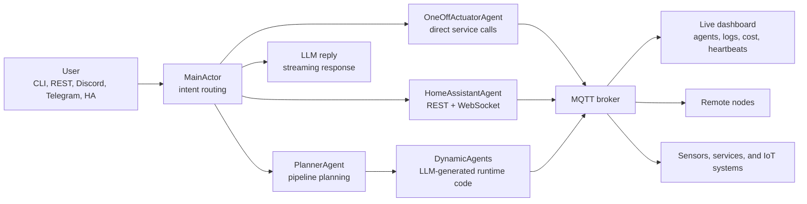

<p align="center">
  
</p>
<p align="center">
  <picture>
    <source media="(prefers-color-scheme: dark)"  srcset="https://raw.githubusercontent.com/waldiez/wactorz/main/.github/assets/title-dark.svg">
    <source media="(prefers-color-scheme: light)" srcset="https://raw.githubusercontent.com/waldiez/wactorz/main/.github/assets/title-light.svg">
    
  </picture>
</p>

<p align="center"><strong>Build AI agents that keep running — across your home, robots, and spare computers.</strong></p>

<p align="center">
<a href="https://docs.waldiez.io/wactorz/">Docs</a> |
<a href="https://docs.waldiez.io/wactorz/guide/deployment.html">Get started</a> |
<a href="https://docs.waldiez.io/wactorz/guide/architecture.html">Architecture</a> |
<a href="https://github.com/waldiez/wactorz/blob/main/ha-addon/DOCS.md">Home Assistant Addon</a> |
<a href="https://github.com/waldiez/wactorz/issues">Issues</a>
</p>

<p align="center">
<a href="https://github.com/waldiez/wactorz/actions/workflows/ci.yml"></a>
<a href="https://pypi.org/project/wactorz/"></a>
<a href="https://github.com/waldiez/wactorz/blob/main/LICENSE"></a>
<a href="https://python.org"></a>
<a href="https://mosquitto.org"></a>
<a href="https://github.com/waldiez/wactorz/blob/main/ha-addon/DOCS.md"></a>

</p>

---

<!--
  TODO(promo): drop a hero demo GIF here — the highest-impact addition to this README.
  Record a ~15s screencast of the dashboard running one end-to-end automation
  (e.g. the "person detected on camera → office light on" example below), export
  to GIF, commit under .github/assets/demo.gif, and uncomment:

  <p align="center"></p>
-->

Wactorz is a self-hosted runtime for AI that needs to do more than answer once.
Describe an automation in chat and its planner can write a Python agent, run it as
a supervised actor, and show you what it is doing in a live dashboard. Agents can
listen to sensors and MQTT topics, act through Home Assistant or other services,
keep state across restarts, and run on another machine when the job belongs closer
to the hardware.

Bring a hosted model from Anthropic, OpenAI, Gemini, or NVIDIA NIM, or keep model
inference local with Ollama. The runtime, agent state, dashboard, and MQTT control
plane remain on hardware you control.

---

## Who it is for

Wactorz is built first for **technical hobbyists and makers**: people connecting a
smart home, robot, camera, Raspberry Pi, or old laptop who are comfortable using a
terminal and editing a configuration file. It is also useful to **Python developers**
who want an extensible actor runtime instead of a one-shot agent script.

It is currently a beta, not a no-code consumer app or a multi-user hosted service.
Agents can execute generated Python, so use it on systems you control and review the
[security model](https://docs.waldiez.io/wactorz/guide/security.html) before exposing
it to a network.

## What you can build

- Persistent automations that react to sensor readings, schedules, and MQTT events.
- Home Assistant actions described in chat rather than hand-authored for every case.
- Robot and edge-device agents that run close to their cameras, microphones, or motors.
- Small groups of agents that keep state, restart independently, and move between nodes.
- Custom Python agents with REST, MCP, Discord, Telegram, or WhatsApp as an interface.

---

## Quick start

The most predictable first run uses Docker Compose. You need Git, Docker with the
Compose plugin, and an API key for your chosen model provider.

```bash
git clone https://github.com/waldiez/wactorz
cd wactorz
cp .env.template .env
```

Open `.env` and set at least these values:

```dotenv
MQTT_PASSWORD=choose-a-long-random-password
LLM_PROVIDER=anthropic
LLM_MODEL=claude-sonnet-4-6
LLM_API_KEY=your-key-here
```

Then start Wactorz:

```bash
docker compose --profile python up -d
```

Open the dashboard at [http://localhost:8888](http://localhost:8888). Follow the
logs with `docker compose logs -f wactorz-python` and stop everything with
`docker compose --profile python down`.

> [!IMPORTANT]
> Docker Compose publishes the dashboard to `127.0.0.1` and Wactorz agents execute
> code. **Set `API_KEY` before changing that binding or exposing it beyond loopback.**
> See [Security](#security) before deploying anywhere shared.

On Windows, use `Copy-Item .env.template .env` instead of `cp`. To install from
PyPI, use Ollama, or run inside Home Assistant, see the
[deployment guide](https://docs.waldiez.io/wactorz/guide/deployment.html). Repository
contributors should start with the
[development setup](https://docs.waldiez.io/wactorz/guide/development.html).

---

## Try an automation

Once the dashboard is connected to the services or devices named in a request, try:

```text
when a person is detected in my pc camera, open the office light
when the door opens, make reachy wakeup
when the light has been on for too long, send me a discord notification
```

---

## Architecture



---

## Interfaces

| Interface | How to use it |
|---|---|
| CLI | `python -m wactorz` |
| Live dashboard | `http://localhost:8888` |
| REST API | `python -m wactorz --interface rest` |
| Discord | `python -m wactorz --interface discord` |
| Telegram | `python -m wactorz --interface telegram` |
| WhatsApp | `python -m wactorz --interface whatsapp` |
| MCP server | `wactorz-mcp` |
| Home Assistant addon | One-click install inside the HA Supervisor |

---

## Choose a model

Set `LLM_PROVIDER`, `LLM_MODEL`, and `LLM_API_KEY` in `.env`. The generic key works
with every hosted provider, or you can use its provider-specific variable.

| Provider | `LLM_PROVIDER` | Example model | Provider-specific key |
|---|---|---|---|
| Anthropic | `anthropic` | `claude-sonnet-4-6` | `ANTHROPIC_API_KEY` |
| OpenAI | `openai` | `gpt-4o` | `OPENAI_API_KEY` |
| Google Gemini | `gemini` | `gemini-2.5-flash` | `GEMINI_API_KEY` |
| NVIDIA NIM | `nim` | `meta/llama-3.3-70b-instruct` | `NIM_API_KEY` |
| Ollama | `ollama` | `llama3` | No key; configure `OLLAMA_URL` |

Wactorz logs the resolved provider and model at startup. Advanced setups can
[route different jobs to different models](https://docs.waldiez.io/wactorz/guide/architecture.html#per-call-site-overrides)
and use the [evaluation harness](https://github.com/waldiez/wactorz/blob/main/docs/evaluation.md)
before choosing them.

---

## Security

> Wactorz is under active development. The perimeter is closed by default; the
> remaining caveats below are about what an *authenticated* caller can do.

**What protects an install:**

- **The API and dashboard require a key.** Set `API_KEY` and every route, the WebSocket
  handshake, the Prometheus scrape, and the login flow are authenticated — constant-time
  comparison, session cookies that survive a restart, and sign-in throttling.
- **The server binds to `127.0.0.1`.** Reaching it from the network is deliberate: set
  `WACTORZ_BIND_HOST` *and* `WACTORZ_EXPOSED_OK=1`. Startup warns if it is exposed
  without a key, or with a guessable one.
- **The broker requires credentials.** Anonymous MQTT is off, and remote nodes are given
  credentials rather than connecting openly.
- Origin and Host allow-lists guard the HTTP surface and the WebSocket handshake against
  cross-site requests and DNS rebinding.

**What to still assume:**

- **Agents execute code.** The planner generates and runs Python, and remote nodes run
  code delivered over MQTT. Anyone holding the API key or the broker credentials can run
  code on the host and on every connected node — treat both as root-equivalent, the same
  way you would an Ansible control node.
- Generated code is screened by a best-effort blocklist, **not a sandbox**.

**Deployment rules:**

- ✅ Set `API_KEY` before exposing anything beyond loopback.
- ✅ Prefer the **Home Assistant add-on**, which keeps the UI behind HA's ingress auth.
- ✅ Keep the broker on a network you control, with credentials set.
- ❌ **Do not** run it as a multi-user or multi-tenant service — there is one key, not
  per-user accounts, and no isolation between agents.
- If you reach it remotely, prefer a VPN or an authenticating reverse proxy over a bare
  port-forward, even with a key set.

More detail in [docs/security.md](https://github.com/waldiez/wactorz/blob/main/docs/security.md).
Found a security issue? Please see [SECURITY.md](https://github.com/waldiez/wactorz/blob/main/SECURITY.md)
rather than opening a public issue.

---

## Repository Map

| Path | What lives there |
|---|---|
| `wactorz/` | Python actor runtime, built-in agents, interfaces, monitoring, HA integration |
| `frontend/` | Vite + TypeScript card dashboard |
| `ha-addon/` | Home Assistant Supervisor addon |
| `docs/` | Markdown docs source |
| `infra/` | Mosquitto, Prometheus, nginx, and HA configs |
| `tests/` | Python test suite |

---

## Documentation

| Start here | For |
|---|---|
| [Quickstart](https://github.com/waldiez/wactorz/blob/main/docs/quickstart.md) | First run and Windows setup |
| [Docker Hub](https://docs.waldiez.io/wactorz/guide/dockerhub.html) | Run from Docker without cloning the repo |
| [Architecture](https://docs.waldiez.io/wactorz/guide/architecture.html) | Actor system, supervision, MQTT flow |
| [Agents](https://docs.waldiez.io/wactorz/guide/agents.html) | Built-in agents, recipes, and dynamic agents |
| [Pipelines](https://docs.waldiez.io/wactorz/guide/pipelines.html) | Reactive automation patterns |
| [Remote nodes](https://docs.waldiez.io/wactorz/guide/remote-nodes.html) | Edge deployment over SSH |
| [Interfaces](https://docs.waldiez.io/wactorz/guide/interfaces.html) | CLI, REST, chat platforms, dashboard, MCP |
| [API reference](https://github.com/waldiez/wactorz/blob/main/docs/api.md) | REST endpoints and payloads |
| [Deployment](https://docs.waldiez.io/wactorz/guide/deployment.html) | Docker, Home Assistant add-on, environment setup |
| [Prometheus](https://docs.waldiez.io/wactorz/guide/prometheus.html) | Metrics and monitoring |
| [Security](https://github.com/waldiez/wactorz/blob/main/docs/security.md) | Auth, exposure, broker credentials, threat model |
| [Evaluation harness](https://github.com/waldiez/wactorz/blob/main/docs/evaluation.md) | Compare models per LLM call site |
| [Technical reference](https://github.com/waldiez/wactorz/blob/main/docs/reference.md) | Deeper internals |

---

## Contributors

<!-- ALL-CONTRIBUTORS-LIST:START - Do not remove or modify this section -->
<!-- prettier-ignore-start -->
<!-- markdownlint-disable -->
<table>
  <tbody>
    <tr>
      <td align="center" valign="top" width="14.28%">
        <a href="https://github.com/ounospanas">
          
          <br /><sub><b>Panagiotis Kasnesis</b></sub>
        </a>
        <br />
        <a href="#projectManagement-ounospanas" title="Project Management">📆</a>
        <a href="https://github.com/waldiez/wactorz/commits?author=ounospanas" title="Code">💻</a>
      </td>
      <td align="center" valign="top" width="14.28%">
        <a href="https://github.com/lazToum">
          
          <br /><sub><b>Lazaros Toumanidis</b></sub>
        </a>
        <br />
        <a href="https://github.com/waldiez/wactorz/commits?author=lazToum" title="Code">💻</a>
        <a href="#design-lazToum" title="UI & Design">🎨</a>
      </td>
      <td align="center" valign="top" width="14.28%">
        <a href="https://github.com/hchris0">
          
          <br /><sub><b>Chris</b></sub>
        </a>
        <br />
        <a href="https://github.com/waldiez/wactorz/commits?author=hchris0" title="Code">💻</a>
        <a href="#userTesting-hchris0" title="User Testing">📓</a>
      </td>
      <td align="center" valign="top" width="14.28%">
        <a href="https://github.com/amaliacontiero">
          
          <br /><sub><b>Amalia Contiero</b></sub>
        </a>
        <br />
        <a href="https://github.com/waldiez/wactorz/commits?author=amaliacontiero" title="Code">💻</a>
        <a href="#promotion-amaliacontiero" title="Promotion">📣</a>
      </td>
    </tr>
  </tbody>
</table>
<!-- markdownlint-restore -->
<!-- prettier-ignore-end -->
<!-- ALL-CONTRIBUTORS-LIST:END -->

Contributions of any kind are welcome. See [CONTRIBUTING.md](https://github.com/waldiez/wactorz/blob/main/CONTRIBUTING.md) to get started.

---

## Contributing

| What | How |
|---|---|
| Found a bug | [Open an issue](https://github.com/waldiez/wactorz/issues/new?template=bug_report.yml) |
| Have an idea | [Start a discussion](https://github.com/waldiez/wactorz/discussions) |
| Want to code | Fork, branch, and open a PR against `dev` (`main` is releases only) |
| Docs, tests, UI | Same drill, open a PR |
| New agent recipe | Add it in `wactorz/catalogue_agents/` and open a PR |
| Home Assistant | HA integrations and addon config PRs are very welcome |

Read [CONTRIBUTING.md](https://github.com/waldiez/wactorz/blob/main/CONTRIBUTING.md) for setup instructions, code style, and the PR process.

---

## License

[Apache 2.0](https://github.com/waldiez/wactorz/blob/main/LICENSE). Free to use, modify, and distribute.
